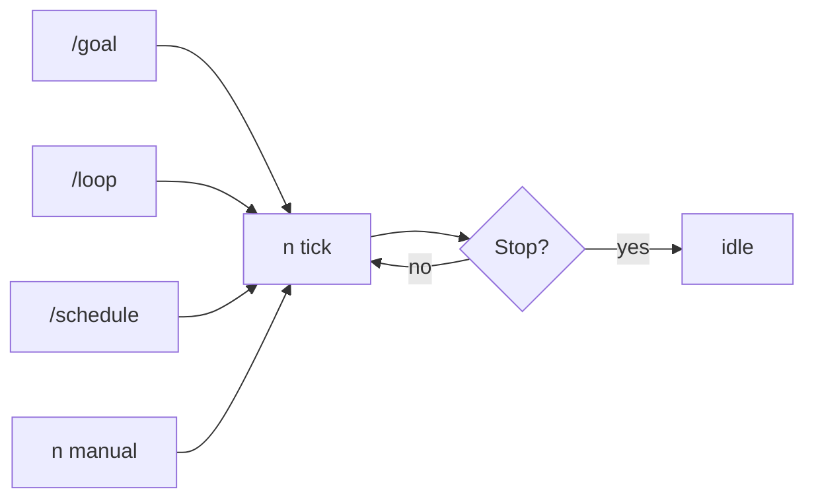
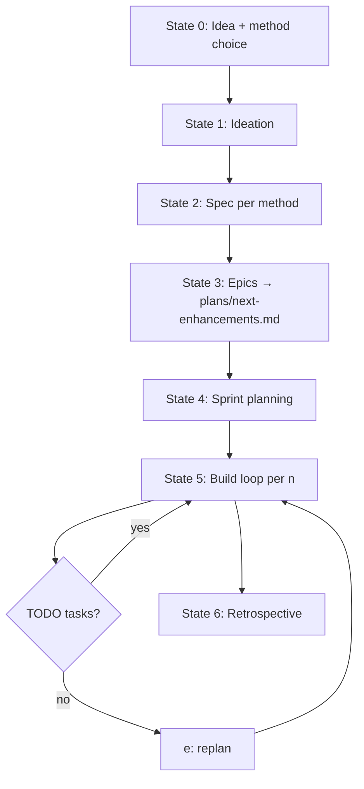

# NEXT-Method — Unified Plan

A single design document tracing the evolution of **NEXT-Method** from a BMAD wrapper into a hybrid orchestrator over **BMAD, Spec Kit, OpenSpec, design.md, Karpathy, Pocock, and autonomous-coding-agents**. The live agent instructions are in [`AGENTS.md`](../AGENTS.md) at the repo root.

---

## 1. Problem

Modern AI-assisted SDLC is a **toolbox overload**. This repo bundles seven submodules — each with its own commands, skills, and conventions:

| Submodule | What you'd otherwise manage yourself |
|-----------|--------------------------------------|
| `BMAD-METHOD/` | 11+ workflow commands, PRD/UX/architecture, epics, sprint YAML |
| `spec-kit/` | GitHub async spec format (Background → Problem → Solution → Impact) |
| `OpenSpec/` | AI-native structured specifications |
| `design.md/` | Google minimalist unified design doc |
| `mattpocock-skills/` | Grill sessions, `to-prd`, `to-issues`, TDD loops |
| `andrej-karpathy-skills/` | Baseline-first, zero-dependency implementation |
| `autonomous-coding-agents/` | `n` / `e` task queue, `plans/next-enhancements.md` |

Remembering **which framework to spec with**, **which skills to invoke when**, and **what step comes next** creates the same friction BMAD alone already has — administrative overhead instead of building.

**NEXT-Method** solves this with an **Orchestrator Agent** that:

- Tracks SDLC phase in the background
- Advances on short commands (`n`, `e`, etc.)
- Routes to the right submodule and skills automatically
- Reads prior artifacts before each step
- Hides multi-agent handoffs from the user

Each submodule uses file-based workflows (Markdown specs, skill files, task queues). The orchestrator reads outputs from the previous turn — unidirectional flow automates handover across **all** engines, not just BMAD.

---

## 2. Evolution (three iterations → one system)

### Iteration 1 — BMAD-only wrapper

The original NEXT-Method collapsed BMAD's 4 phases and 11 steps into a linear state machine:

| State | Action | Output |
|-------|--------|--------|
| 0 | Receive idea | — |
| 1 | Analysis | `brainstorming-report.md` |
| 2 | PRD | `prd.md`, `decision-log.md` |
| 3 | UX | `ux-design-specification.md` |
| 4 | Architecture | `architecture.md` (ADRs) |
| 5 | Backlog | `epics.md` |
| 6 | Sprint | `sprint-status.yaml` |
| 7a–7c | Build loop | `story-[slug].md`, code, review |
| 8 | Close | `retro-[epic].md` |

**Limitation:** Every project got full enterprise planning whether it needed it or not.

### Iteration 2 — Multi-spec hybrid

Added a **router state** so users pick a specification framework at start:

- **BMAD Spec** — full PRD + UX + architecture
- **GitHub Spec Kit** — async Problem → Solution → Impact
- **OpenSpec** — AI-native machine-readable specs

Shared engines: BMAD (tracking/backlog) + Karpathy (lean implementation).

**Benefit:** Scales from weekend projects to enterprise compliance without changing the build loop.

### Iteration 3 — design.md + Karpathy elite pipeline

Replaced bloated multi-file BMAD planning with **Google design.md** — one developer-centric document for requirements, schemas, and architecture (~60% less planning overhead).

**Karpathy skills** injected into the build loop: simple baselines first, zero-dependency code, iterative complexity — acting as a quality gate against LLM bloat.

Hybrid modifiers introduced: `n baseline`, `n optimize`, `n pivot [change]`.

### Iteration 4 — Autonomous orchestration

Typing `n` repeatedly is still manual. **`n` = atomic tick**; **`/goal`**, **`/loop`**, and **`/schedule`** are schedulers that re-invoke `n` until a stop condition.

- **State file:** `plans/autonomous-state.yaml` tracks `mode`, `method`, `current_state`, `ticks`, and `stop_reason`
- **Guard:** AFK only after State 0 (`method` locked)
- **Stop when:** `goal` in `autonomous-state.yaml` is achieved, user types `stop`, build fails 3× on same task, or `max_ticks` reached — **not** when `[TODO]` is empty (auto-`e` refills the queue)



### Current — unified hybrid (this repo)

All iterations merged into one orchestrator with **five planning methods**, **autonomous task advancement**, and **smart method recommendation**:

| # | Method | Submodule | Best for |
|---|--------|-----------|----------|
| 1 | BMAD Spec | `BMAD-METHOD/` | Enterprise — PRD, UX, architecture, ADRs |
| 2 | GitHub Spec Kit | `spec-kit/` | Standard features, async handoffs |
| 3 | OpenSpec | `OpenSpec/` | AI-driven, machine-readable constraints |
| 4 | Google design.md | `design.md/` | Solo/small team, one lean design doc |
| 5 | Matt Pocock | `mattpocock-skills/` | Grill → PRD → vertical slices → TDD ([walkthrough](https://youtu.be/EJyuu6zlQCg?list=PLObGca0kDpT4)) |

**Always-on engines** (not user-selected):

| Engine | Submodule | Role |
|--------|-----------|------|
| Autonomous Coding Agents | `autonomous-coding-agents/` | `n` / `n{x}` / `e` task loop via `plans/next-enhancements.md` |
| BMAD-METHOD | `BMAD-METHOD/` | Epics, sprint tracking, code review, retrospective |
| Karpathy Skills | `andrej-karpathy-skills/` | Baseline-first, lean implementation |

---

## 3. Repository structure

```text
next-methods/
├── AGENTS.md                      # Live agent instructions (single source of truth)
├── README.md
├── .gitmodules
├── plans/                         # next-enhancements.md, autonomous-state.yaml (runtime)
├── docs/                          # feature-list.md (runtime)
├── _bmad-output/                  # Planning & sprint artifacts (runtime)
├── next-method-plan/
│   └── NEXT-METHOD-PLAN.md        # This document
├── autonomous-coding-agents/      # n/e advancement engine
├── BMAD-METHOD/
├── andrej-karpathy-skills/
├── mattpocock-skills/
├── spec-kit/
├── OpenSpec/
└── design.md/
```

Clone with submodules:

```bash
git clone --recurse-submodules https://github.com/abdshomad/next-methods.git
cd next-methods
git submodule update --init --recursive
```

---

## 4. User workflow

### Step 1 — Share idea

User describes the project. Agent **recommends** the best-fit method with a one-line rationale, then shows the full numbered menu. User confirms or overrides — workflow never auto-starts.

### Step 2 — Choose method

Accept `1`–`5`, `n 1`–`n 5`, or name aliases (`n bmad`, `n pocock`, etc.). Bare `n` at this stage re-shows the menu.

**Example:**

> **User:** Let's build a local markdown-based personal wiki using Next.js.
>
> **Agent:** For a solo Next.js wiki, I'd suggest **#4 — Google design.md** because one lean design doc is enough. You can accept that or pick below:
>
> 1. BMAD Spec — …
> 2. GitHub Spec Kit — …
> …
>
> **User:** `4` *(or `n design`)*

### Step 3 — Automated flow

After method lock-in, each **`n`** advances the state machine and (during build) executes tasks from `plans/next-enhancements.md` per [`autonomous-coding-agents/AGENTS.md`](../autonomous-coding-agents/AGENTS.md).

---

## 5. State machine



### Phase 1 — Ideation & routing

| State | Action | Output |
|-------|--------|--------|
| 0 | Recommend method, show menu, wait for choice | — |
| 1 | Brainstorm (methods 1–4) or grill session (method 5) | `brainstorming-report.md` or `grill-session.md` |

### Phase 2 — Dynamic specification

| Method | State 2 outputs |
|--------|-----------------|
| BMAD Spec | `prd.md`, `ux-design-specification.md`, `architecture.md` |
| Spec Kit | `_bmad-output/spec.md` |
| OpenSpec | `_bmad-output/open-spec.md` |
| design.md | `_bmad-output/design.md` |
| Pocock | `_bmad-output/prd.md`, `_bmad-output/issues/*.md` |

### Phase 3 — Backlog

| State | Action | Output |
|-------|--------|--------|
| 3 | `bmad-create-epics-and-stories` | `epics.md` → mirror to `plans/next-enhancements.md` |
| 4 | `bmad-sprint-planning` | `sprint-status.yaml` |

### Phase 4 — Build loop (per `n`)

| Sub-state | Action |
|-----------|--------|
| 5a | Pick most impactful `[TODO]` from `plans/next-enhancements.md` → `story-[slug].md` |
| 5b | Karpathy baseline (or Pocock `tdd` + red-green-refactor) |
| 5c | Full implementation — 256-LOC rule, dependency-light |
| 5d | Code review, mark `[DONE]`, update `docs/feature-list.md`, `sprint-status.yaml` |

### Phase 5 — Close

| State | Action | Output |
|-------|--------|--------|
| 6 | `bmad-retrospective` | `retro-[epic].md` |

---

## 6. Commands

| Command | When | Action |
|---------|------|--------|
| `n` / `next` | After method chosen | Advance state / run next `[TODO]` task |
| `n{x}` (e.g. `n3`) | Build phase | Run top `{x}` tasks sequentially |
| `e` / `enhance` | Anytime | Regenerate `plans/next-enhancements.md` (3 per section) |
| `1`–`5` / `n bmad` etc. | State 0 | Lock planning method |
| Bare `n` | State 0 | Re-show method menu |

### Advanced overrides (from iteration 3)

| Modifier | Use |
|----------|-----|
| `n + modify [feedback]` | Next step with specific feedback applied |
| `n established` | Brownfield — run project-context instead of greenfield start |
| `n fix` | Loop back to fix bugs in `deferred-work.md` |
| `n baseline` | Force dumb baseline only (Karpathy) |
| `n optimize` | Re-review code through Karpathy lens, rewrite leaner |
| `n pivot [change]` | Update design/spec, cascade to epics and sprint |

---

## 7. Method selection guide

| Suggest when… | Method |
|---------------|--------|
| Large / multi-surface (FE + BE + UX + compliance) | **1 — BMAD Spec** |
| Clear feature, async handoff or stakeholder review | **2 — GitHub Spec Kit** |
| Vague, agent-driven, machine-readable constraints | **3 — OpenSpec** |
| Solo dev or small team, lean planning | **4 — Google design.md** |
| Ambiguous requirements, TDD-first agent loops | **5 — Matt Pocock** |

---

## 8. Why this architecture works

1. **Pick your planning weight** — enterprise BMAD, async Spec Kit, AI-native OpenSpec, lean design.md, or Pocock grill-to-ship — same build engine underneath.
2. **One command to advance** — `n` hides BMAD steps, spec-format decisions, skill invocation, and autonomous task execution.
3. **File-based context** — each step reads prior artifacts; no manual context stitching.
4. **Autonomous task queue** — [`autonomous-coding-agents`](../autonomous-coding-agents/) drives impact-prioritized execution with `plans/next-enhancements.md`.
5. **Lean code by default** — Karpathy (and Pocock TDD) counter LLM bloat during implementation.
6. **Smart defaults** — agent recommends a method but user always has final say.

---

## 9. Artifact map

| Path | Created by | Purpose |
|------|------------|---------|
| `_bmad-output/brainstorming-report.md` | State 1 (methods 1–4) | Ideation |
| `_bmad-output/grill-session.md` | State 1 (method 5) | Pocock alignment |
| `_bmad-output/*.md` (spec artifacts) | State 2 | Method-specific spec |
| `_bmad-output/epics.md` | State 3 | Story breakdown |
| `_bmad-output/sprint-status.yaml` | State 4 | Sprint tracking |
| `_bmad-output/story-[slug].md` | State 5a | Per-task story |
| `_bmad-output/deferred-work.md` | State 5d | Tech debt log |
| `_bmad-output/retro-[epic].md` | State 6 | Retrospective |
| `plans/next-enhancements.md` | States 3–5 | `[TODO]` / `[DONE]` task queue |
| `plans/autonomous-state.yaml` | `/goal`, AFK ticks | `mode`, `method`, `current_state`, stop tracking |
| `docs/feature-list.md` | State 5d | Completed feature log |

---

## 10. Implementation reference

| Document | Role |
|----------|------|
| [`AGENTS.md`](../AGENTS.md) | **Live** agent workflow — use this in Cursor / AI IDE |
| [`README.md`](../README.md) | User-facing quick start and commands |
| This file | Design history, architecture rationale, evolution |

Do not duplicate `AGENTS.md` content here. When behavior changes, update `AGENTS.md` first, then reflect architectural shifts in this plan.
